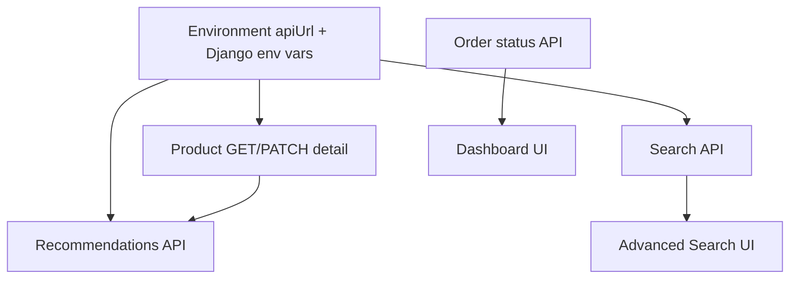

# Tasks — OptoMarket (B2B Wholesale Marketplace)

**Course:** Web Development (KBTU)  
**Team:** Aibar (Lead), Nurali, Akniyet — Full-stack engineers  
**Milestone:** 90% completion by **26.04.2026, 23:59**  
**Defense:** Week 15 (presentation, Postman collection, final demo)

---

## Existing (baseline — already in repo)

- [x] Angular: JWT interceptor, login, client logout, routing, `@if`/`@for` on main pages, `HttpClient` services, multiple `[(ngModel)]` forms
- [x] Django: `UserProfile`, `Category`, `Product`, `Order`; JWT (SimpleJWT); CORS; product list/create/delete; orders create/list; `request.user` ownership checks
- [x] Functional flows: register, login, product grid, add product, buy/order modal, profile (partial)

---

## Shared Architecture — Core architecture & integration (gap closure)

These items cut across the stack and should stay aligned via short daily syncs and a shared `develop` branch.

### Priority 1: Configuration & API foundation (blocking)

- [ ] **Shared:** Add `environment.ts` / `environment.development.ts` / `environment.production.ts` with `apiUrl`; document `.env.example` for Django (no secrets in Git)
- [ ] **Aibar:** Centralized Angular `api.service.ts` (or thin wrapper) — all HTTP base URL from `environment`; migrate call sites off hardcoded `http://127.0.0.1:8000`
- [ ] **Akniyet:** Remove duplicate routes in [`optomarket_back/urls.py`](Server/optomarket_back/optomarket_back/urls.py); single `include('api.urls')` pattern
- [ ] **Akniyet:** Clean redundant / duplicate imports in [`api/views.py`](Server/optomarket_back/api/views.py) (single import block, no mid-file repeats)

### Priority 2: Product API completeness

- [ ] **Aibar:** `ProductDetail` API — **GET by ID** (public or authenticated per spec); **PUT/PATCH** with **owner-only** permission; consistent serializer validation
- [ ] **Aibar:** Angular: product detail route + component consuming GET; edit form for seller (PATCH) wired to API

### Priority 3: Auth lifecycle (JWT refresh + secure logout)

- [ ] **Nurali:** Backend: `rest_framework_simplejwt` token blacklist app; **logout** endpoint (blacklist refresh/access per chosen strategy); document token pair usage
- [ ] **Nurali:** Frontend: store refresh token securely; refresh flow (interceptor or auth service) on 401 / before access expiry; call logout API on sign-out where applicable

### Priority 4: Security hardening (Django)

- [ ] **Aibar:** `SECRET_KEY`, `DEBUG`, `ALLOWED_HOSTS`, `CORS_ALLOWED_ORIGINS` from environment variables; production-ready defaults documented for defense demo

### Priority 5: Code health & rubric polish

- [ ] **Nurali:** Replace remaining `*ngIf` / `*ngFor` with `@if` / `@for` (payment modal, product cards edge cases, etc.)
- [ ] **Nurali:** Replace `alert()` with reusable **Toast / Notification** service + component; consistent error surfacing for HTTP failures

---

## AIBAR — Team Lead / Core Systems

### Priority 1: Product detail API (backend)

- [ ] Implement GET `/api/products/<id>/` with correct permissions and pagination compatibility if needed
- [ ] Implement PUT/PATCH `/api/products/<id>/` — only `product.owner == request.user`; return 403 otherwise
- [ ] Align `ProductSerializer` for partial updates (PATCH); validate category, stock, price

### Priority 2: Security & environments (backend)

- [ ] Django settings: read `SECRET_KEY`, `DEBUG`, `ALLOWED_HOSTS`, CORS from env; provide `.env.example`
- [ ] Verify `python manage.py check --deploy` recommendations for demo configuration

### Priority 3: Centralized API client (frontend)

- [ ] Add `environment*.ts` and inject `apiUrl` into a small `ApiService` or shared helper used by feature services
- [ ] Refactor `ProductService`, `AuthService`, login/register/profile/order calls to use centralized base URL

### Priority 4: Recommendation engine (backend)

- [ ] Design rule-based algorithm: e.g. top **4** products — same `category` as current product, fallback by **similar price band** (e.g. ±20%) if not enough
- [ ] Expose endpoint e.g. `GET /api/products/<id>/recommendations/` (or query param variant); document logic in code comments for defense

### Priority 5: Integration (frontend)

- [ ] Product detail page: display product; call recommendation API; render recommendation cards with link to detail
- [ ] Ensure interceptor / `SKIP_AUTH` behavior matches public vs protected routes

---

## NURALI — UX & Lifecycle Management

### Priority 1: JWT blacklist & logout (backend)

- [ ] Enable `rest_framework_simplejwt.token_blacklist` in `INSTALLED_APPS`; run migrations
- [ ] Add logout view(s): blacklist refresh token on logout; clarify client contract (access vs refresh) in README
- [ ] Register routes under `/api/...` consistent with existing JWT URLs

### Priority 2: Template control flow (frontend)

- [ ] Audit all templates; migrate `*ngIf` / `*ngFor` to `@if` / `@for` for rubric compliance
- [ ] Run `ng build` / tests; fix hydration or SSR edge cases if any

### Priority 3: Standardized error handling (frontend)

- [ ] Implement `NotificationService` + toast UI (standalone component); severity levels (error, success, info)
- [ ] Replace `alert()` in login, register, product list order flow, etc.

### Priority 4: Order lifecycle tracker (backend)

- [ ] Extend `Order.status` model field: controlled values e.g. `Pending` → `Shipped` → `Delivered` (and optional `Cancelled`)
- [ ] Add transitions: who may change status (seller for their product’s orders vs buyer read-only — **define with team**)
- [ ] Endpoints: PATCH order status or dedicated `/api/orders/<id>/transition/`; enforce permissions

### Priority 5: Order lifecycle (frontend) + OrdersService

- [ ] UI: order list with status badges and timeline (or stepper) reflecting backend state
- [ ] Repair [`OrdersService`](Client/optomarket/src/app/services/orders.ts): use environment base URL; inject in **Profile**; remove inline `HttpClient.get` duplication
- [ ] Wire seller/buyer views per role if required by business rules

---

## AKNIYET — Data, Search & Analytics

### Priority 1: Router & views hygiene (backend)

- [ ] Finalize deduplicated `urlpatterns`; ensure no double registration of `token/` or `products/`
- [ ] Normalize `views.py` imports and remove debug `print` statements (replace with logging if needed)

### Priority 2: Dynamic price analytics (backend)

- [ ] Replace static `price_stats` response with DB aggregates: **min**, **max**, **avg** (and optional count) over `Product.price` (and filters e.g. in-stock only)
- [ ] Optional: group by `category` for richer demo

### Priority 3: Product search API (backend)

- [ ] Multi-criteria filter using `django.db.models.Q`: name (icontains), category, price range, stock > 0, etc.
- [ ] Expose as `GET /api/products/search/` or extend list endpoint with query params; document query contract for Angular

### Priority 4: Advanced search (frontend)

- [ ] Filter sidebar: price min/max, category select, **rating** filter *(add rating field + migration if missing, or document as Phase 2 / stub with clear “demo” label for defense)*
- [ ] Bind filters with `[(ngModel)]`; debounce search; call search API; sync with product list or dedicated results view

### Priority 5: Market dashboard (full-stack)

- [ ] Backend: lightweight aggregates endpoint(s) — e.g. total spent, active orders count, optional price trend series (simple per-day or per-category averages)
- [ ] Frontend: **Market Dashboard** page (buyer/seller variants): charts or summary cards; reuse notification service for errors
- [ ] Add route + nav entry; role-based visibility

---

## Summary Table

| Member   | Django (primary)                                      | Angular (primary)                                      |
|----------|--------------------------------------------------------|--------------------------------------------------------|
| **Aibar**    | Product detail CRUD completion, recommendations API, env security | `environment` + API base, product detail + recommendations UI |
| **Nurali**   | JWT blacklist, logout API, order status transitions    | `@if`/`@for` refactor, toast notifications, order tracker UI, `OrdersService` + profile |
| **Akniyet**  | URLs/views cleanup, dynamic `price_stats`, Q-object search, dashboard API | Advanced search sidebar, dashboard page, filter UX |

*Workload:* Each member owns **roughly 3 backend + 3 frontend** deliverables in the priorities above; adjust subtasks if one stream finishes early.

---

## Cross-team dependencies

- **Aibar** should land **environment + Product detail API** before **Akniyet** finalizes search filters that depend on stable query params; **Nurali** coordinates logout/refresh contract before everyone tests auth flows end-to-end.

---

## Deadline Notes

| Phase | Due | Outcome |
|--------|-----|--------|
| Main development | **26.04.2026, 23:59** | All `[ ]` items above implemented or explicitly deferred with mentor approval |
| Week 15 | Defense week | Polished demo, Postman collection (auth + CRUD + search + orders + analytics), slide deck |

**Focus order for sprint:** (1) environments + URL cleanup, (2) product detail + search API, (3) JWT refresh/logout, (4) order lifecycle, (5) dashboard + recommendations + UX polish.

---

## Definition of Done (per task)

- Code reviewed by at least one other teammate
- No hardcoded API origin in new code paths
- Happy path + one failure path verified (Postman or E2E manual)
- README or `docs/API.md` snippet updated for new endpoints
